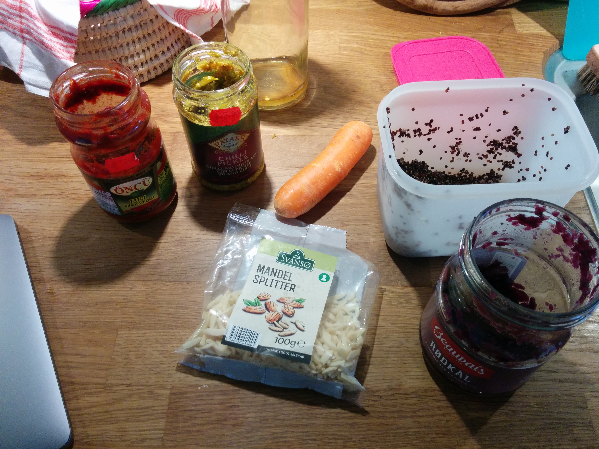
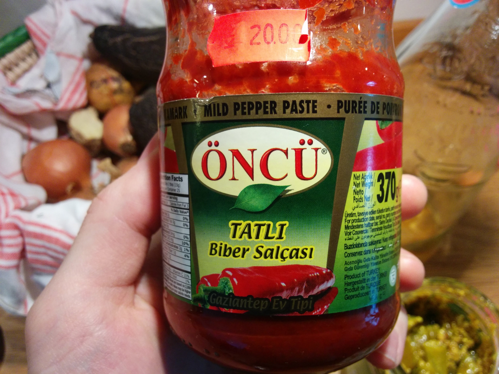
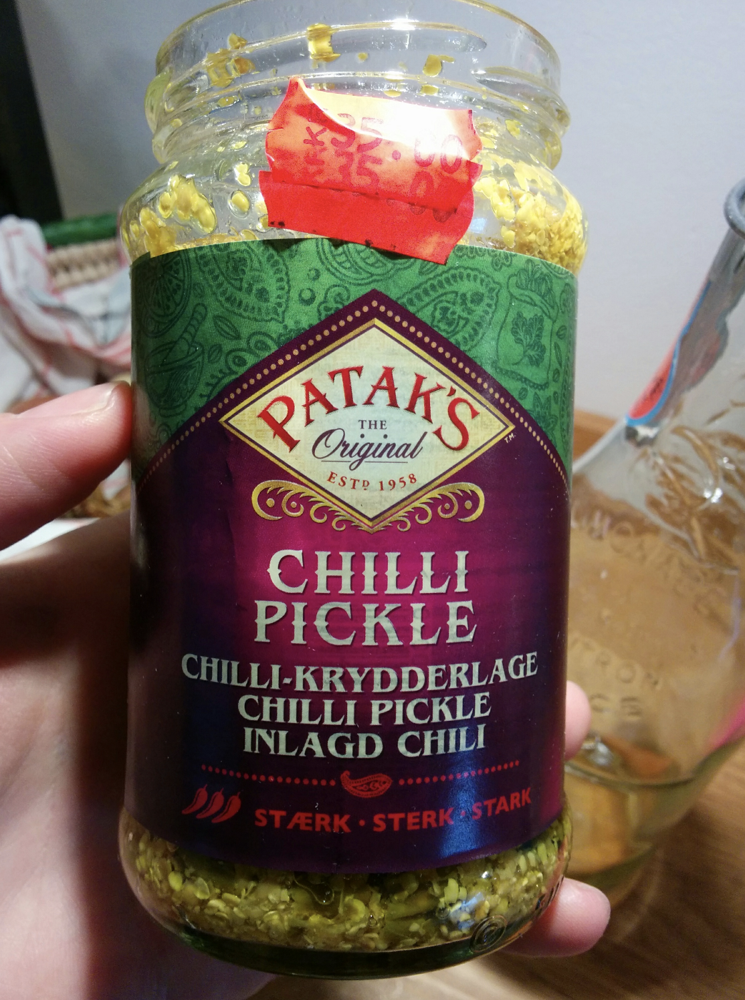

# Chaotic carrot chili

### ingredients

2  carrot  
1 quinoa  
1  pickled red cabbage  
0.25 Tahin  
0.15 red pepper paste  
0.1  mandler, hakkede

#### spices

fresh ginger  
pickled chili \(curry flavour\)  
black pepper

| taxonomy | value |
| :--- | :--- |
| category | salad |
| style | food salad |

#### Human feelings

Crunchy, comforting, filling, fresh, spicy, umami

### Pictures of special ingredients

